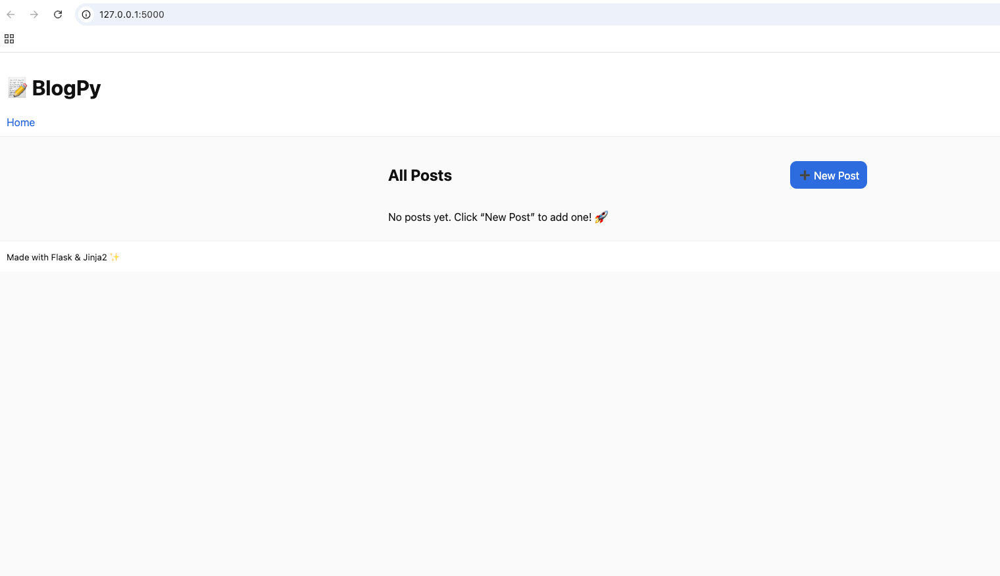

# 📝 BlogPy — Flask + Jinja2 Capstone

A tiny blog app (Create/Read/Update/Delete) using **Flask + Jinja2**, no database (in-memory).  
Goal: show **full-stack skills** with clean UI + a tiny **“AI touch”** (auto summary & keyword tags).

## ✨ Features
- Create / Read / Update / Delete posts (in-memory)
- Responsive UI, light/dark mode
- Auto **1-sentence summary** + **keyword tags** (simple heuristics, no external API)

## 🗂️ Structure
app.py
templates/ (Jinja2: base, index, new, edit)
static/style.css



## 🚀 Run locally
```bash
python3 -m venv .venv
source .venv/bin/activate        # Windows: .venv\Scripts\activate
pip install -r requirements.txt
python app.py
# open http://127.0.0.1:5000

📷 Screenshots

Home: list posts, summary + tags, Edit/Delete

New: create form

Edit: update with preview summary/tags
'''

🌱 Notes

Data is not persisted (cleared on restart). Perfect for quick demo/portfolio.

Add a DB (SQLite/Postgres) easily later by swapping the in-memory posts list.

🧠 Mini AI touch

make_summary(content): first sentence + clip length

extract_tags(title, content): tokenise → remove stopwords → simple frequency → top-k

