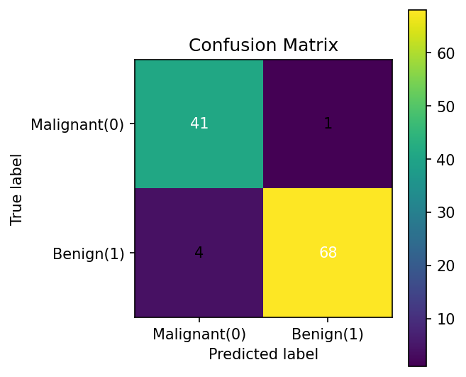
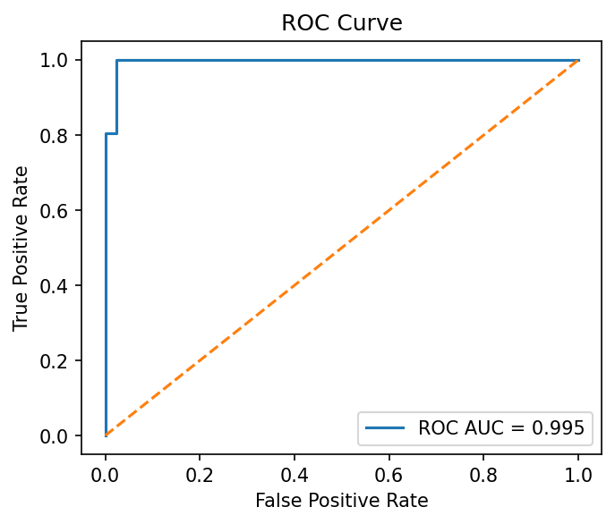
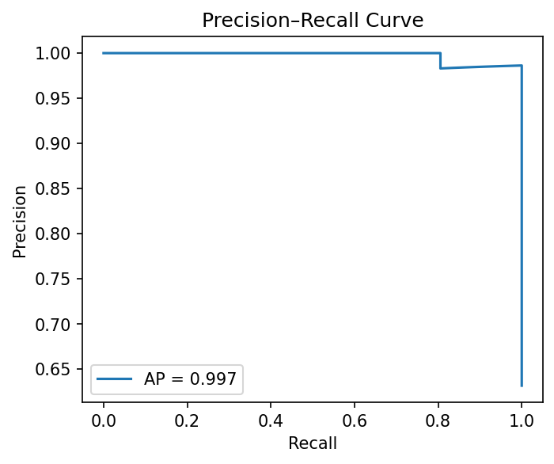

## README.md

```markdown
# 🛟 Survival Prediction (Titanic-style) — Breast Cancer Wisconsin

> End-to-end binary classification project (clean structure, reproducible, recruiter-friendly).
> Stack: `Python`, `scikit-learn`, `Pipeline`, `joblib`, `matplotlib`

### 🔍 Summary
- Dataset: `Breast Cancer Wisconsin (Diagnostic)` (từ `scikit-learn`)
- Goal: Predict **benign (1)** vs **malignant (0)** tumors
- Best-practice model: `StandardScaler → LogisticRegression (class_weight="balanced")`
- Reproducible: one-command run; artifacts & plots auto-saved

### 📂 Project Structure
```

.
├── artifacts/              # saved models & reports
│   ├── model.joblib
│   ├── columns.json
│   ├── metrics.json
│   ├── metrics.eval.json
│   ├── cm.png
│   ├── roc.png
│   └── pr.png
├── data/
│   ├── breast_cancer.csv
│   ├── X_train.csv  X_test.csv
│   └── y_train.csv  y_test.csv
├── notebooks/              # (optional exploration)
├── src/
│   ├── get_data.py
│   ├── explore_split.py
│   ├── train_benchmark.py
│   ├── train_final.py
│   └── predict_cli.py
├── requirements.txt
├── README.md
└── .gitignore

````

### 🚀 Quickstart
```bash
python3 -m venv .venv && source .venv/bin/activate
pip install -r requirements.txt

# 1) Get data
python src/get_data.py

# 2) EDA + split
python src/explore_split.py

# 3) Benchmark (optional)
python src/train_benchmark.py

# 4) Train final model + save artifacts
python src/train_final.py

# 5) Evaluate + plots
python src/eval_viz.py
````

### 📈 Key Results (example)

| Metric        | Score |
| ------------- | ----- |
| Accuracy      | ~0.95 |
| F1 (class 1)  | ~0.95 |
| ROC AUC       | ~0.98 |
| AP (PR Curve) | ~0.98 |

Confusion Matrix / ROC / PR:

<p align="left">
  
  
  
</p>

> *Kết quả có thể thay đổi nhẹ tùy split; số ở trên là tham chiếu.*

### 🔮 Inference (CLI)

```bash
# xem thứ tự cột khi nhập tay
python src/predict_cli.py --show-columns

# dự đoán 1 dòng (điền 30 số theo đúng thứ tự cột)
python src/predict_cli.py --values "..., ..., ..., (30 số)"

# batch CSV (có header đúng tên cột)
python src/predict_cli.py --csv data/X_test.csv --out artifacts/preds.csv
```

### 🧱 Design Choices

* **Pipeline** để đóng gói tiền xử lý + model → tránh lệch schema lúc suy luận.
* **LogisticRegression + class_weight="balanced"** → robust cho lệch lớp nhẹ, dễ giải thích.
* **Saved artifacts** (`model.joblib`, `columns.json`, `metrics*.json`) → sẵn sàng cho API/Streamlit.

### 🧭 What’s Next (roadmap ngắn)

* [ ] Add **Streamlit mini-app** (upload CSV → trả kết quả + chart).
* [ ] SHAP/Permutation importance để **explainability**.
* [ ] **Threshold tuning** theo mục tiêu (precision/recall).
* [ ] **CI check** (black/ruff, unit tests cho data shape & predict).

### 📚 Dataset Credit

* Scikit-learn: `sklearn.datasets.load_breast_cancer(as_frame=True)`

### 🔗 License

MIT

````

---

## .gitignore (paste)

```gitignore
# venv
.venv/
venv/

# python
__pycache__/
*.pyc
*.pyo
*.pyd

# OS
.DS_Store

# artifacts & temp
artifacts/*.png
artifacts/*.csv
# keep model + metrics
!artifacts/model.joblib
!artifacts/columns.json
!artifacts/metrics.json
!artifacts/metrics.eval.json

# notebooks
*.ipynb_checkpoints
````

> Nếu muốn giữ ảnh plots trong repo, bỏ dòng ignore `artifacts/*.png`.

---

## (Optional) Makefile — chạy nhanh

```makefile
.PHONY: setup data split bench train eval all

setup:
	python3 -m venv .venv && . .venv/bin/activate && pip install -r requirements.txt

data:
	. .venv/bin/activate && python src/get_data.py

split:
	. .venv/bin/activate && python src/explore_split.py

bench:
	. .venv/bin/activate && python src/train_benchmark.py

train:
	. .venv/bin/activate && python src/train_final.py

eval:
	. .venv/bin/activate && python src/eval_viz.py

all: data split bench train eval
```

---
